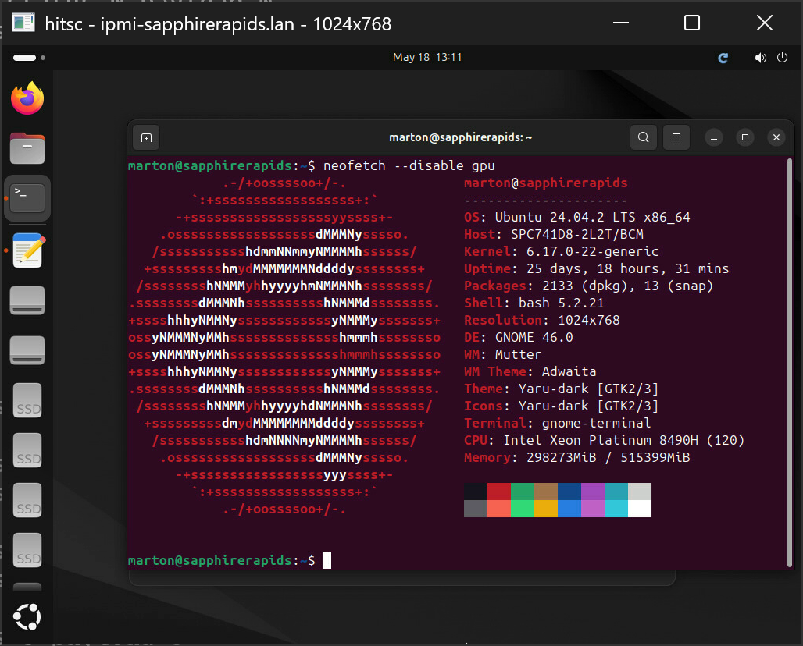

# hitsc

`hitsc` is short for **HTTPS IPMI Terminal Services Client**.

It's a fast, small, and efficient utility to provide a secure iKVM interface to IPMI targets without wading through vendor-specific web interfaces with their subpar-to-downright-hostile UX. The **Terminal Services Client** part is an homage to `mstsc.exe`.

The two supported vendors are **MegaRAC** (ASRockRack and ASUS, works well) and **ATEN** (Supermicro, passable, see notes.) 

The goal is narrow: speak HTTPS, verify TLS certificates, authenticate through the BMC web session, establish a secure `wss://` tunnel, then provide a clean and consistent UX for iKVM interaction through it.



## Scope

Supported today:

- iKVM with basic keyboard and mouse input
- MegaRAC and ATEN
- Console interface to provide target information and options
- Windows only for now

## Build

This is Windows-only for now but 99% portable, Linux/macOS soon.

### Requirements

- Windows.
- Visual Studio C++ tools.
- CMake.
- vcpkg with the repository dependencies installable from `vcpkg.json`.
- Ninja is optional. The build script uses Ninja when present, then NMake, then lets CMake choose a default generator.

### Command

```powershell
.\scripts\build_windows.ps1
```

The default debug binary is written under:

```text
build\windows-debug\hitsc.exe
```

## Usage

Open a MegaRAC iKVM session:

```powershell
.\build\windows-debug\hitsc.exe megarac -u USERNAME https://bmc.example.com
```

Open an ATEN/Supermicro iKVM session:

```powershell
.\build\windows-debug\hitsc.exe aten -u USERNAME https://bmc.example.com
```

Common viewer options:

- `-u, --username TEXT`: username for the BMC web login.
- `-p, --password TEXT`: password for the BMC web login.
- `--password-env TEXT`: read the password from an environment variable.
- `-k, --insecure`: disable certificate and hostname verification.
- `-v, --verbose`: log HTTP request/response and protocol details.
- `--idle-timeout INT`: stop if no WebSocket message arrives for this many seconds; `0` disables it.

ATEN also supports:

- `--exclusive`: request an exclusive RFB session.

Passwords can be passed with `--password`, read from an environment variable with `--password-env`, read from `HITSC_PASSWORD`, or entered at the prompt. `HITSC_USERNAME` can provide the default username.

Use `--help` to inspect the command line:

```powershell
.\build\windows-debug\hitsc.exe --help
.\build\windows-debug\hitsc.exe megarac --help
.\build\windows-debug\hitsc.exe aten --help
```

## Security and Credentials

By default, `hitsc` verifies the server certificate and hostname. On Windows, OpenSSL is configured to use the OS certificate store, so a private root CA trusted by Windows should work for lab BMC certificates.

The client creates its own BMC web session and keeps session cookies in memory for the viewer lifetime. To avoid leaving credentials in shell history or process listings, prefer the password prompt or `--password-env` over `--password`.

For temporary lab debugging only:

```powershell
.\build\windows-debug\hitsc.exe [...] --insecure [...]
```

## Provider Notes

### MegaRAC

The remote session is based on a 100% proprietary protocol. The host sends a packetized byte stream over a WebSocket connection that includes control messages, HW cursor shape/position updates, and a temporal JPEG stream that we decode with the help of [aspeed_codec](https://github.com/AspeedTech-BMC/aspeed_codec). 

It's an efficient and well-structured protocol, that has its quirks from implementation to implementation (HW cursor frames might be empty, etc.) but overall works well, to the extent the BMC's underpowered Linux host is able to keep up.

### Supermicro / ATEN

This is a VNC-based protocol. It talks on a secure WebSocket, so at least that part is good. It uses proprietary vendor-specific packets for screen deltas (temporal JPEG-like compression), USB-encoded HID input for mouse & keyboard events, and HW cursor packets with position and image data that's been observed to be empty in the test environment.

The reason I'm so salty about this protocol is that screen updates are based on a request-response pattern as per the VNC standard, but the requests aren't held on the host until they can be responded to with meaningful data - rather, the server diffs its screen into a new frame and sends it to the client immediately, more often than not in what is effectively a NOP packet. Given the BMC's compute constraints, this limits updates to about 15 fps: the client implements a 66ms delay from when the last screen update is processed, then requests a new update. This is the value used by the HTML client, and unfortunately we can't do anything better; dropping this delay to a "borderline not unpleasant" value of 33ms/30fps causes the BMC to be overworked, resulting in stuck keys, delayed response, and an overall unusable product.

So it works, but it's not great, and it likely won't ever be.

## License and Third-party Code

`hitsc` is MIT licensed; see [LICENSE.md](LICENSE.md).

MegaRAC video decoding uses a trimmed C subset of [AspeedTech-BMC/aspeed_codec](https://github.com/AspeedTech-BMC/aspeed_codec), vendored under [third_party/aspeed_codec](third_party/aspeed_codec). The retained ASPEED files are MPL-2.0 licensed; see [third_party/aspeed_codec/README.md](third_party/aspeed_codec/README.md) and [third_party/aspeed_codec/LICENSE](third_party/aspeed_codec/LICENSE).

Other third-party dependencies are resolved through `vcpkg.json`.

## TODO

This is a work in progress, the current stage not being much more than a sign of life.

- Add Linux and macOS support.
- Add TLS certificate pinning.
- Add PiKVM support
- Add Apple RDP support (yeah it's not IPMI but it's a pain point for me)
- Add UI for connection establishment, making CLI optional
- Add secure credential store (win32 CryptoAPI, macOS keychain, ...)
- Add comfort features such as "type-my-clipboard"
- Better indication of "remote display is off"
- BMC controls for power on/off, reset; indicators for power status
- Scale to fit, 1:1, etc display options.
- Keep the UI tight and minimal

## AI

By rough estimate about 90% of the code was written by AI. Handmade, it'd probably be cleaner and 50% of the size. It'd also have taken 50x longer. I got a basic supermicro and megarac implementation off the ground in about 8 hours. That blows me away. Yes, I did review every commit, and yes, I pushed back when it was doing something stupid, but most of the time it just one-shot the prompts. Code is just wet clay now.
